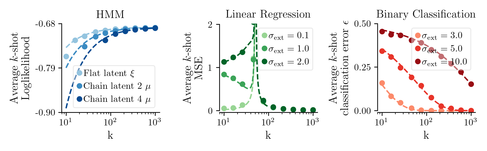

# Few-Shot Analytical

This repository contains code for running few-shot learning with extraneous noise in the input. Includes three different settings: binary classification, linear regression, and Hidden Markov Models (HMM), along with theory.

Reproduces this figure:



## Features

- **Binary Classification**: Prototype learning with class-dependent noise (Sorscher et al., 2022)
- **Linear Regression**: Linear regression with concatenated noise encoding (Hastie et al., 2022)
- **HMM Models**: Flat and chain latent variable models with binomial MLE

## Installation

1. **Clone the repository** (if not already done):
   ```bash
   git clone https://github.com/KabirDabholkar/fewshot_analytical.git
   cd fewshot_analytical
   ```

2. **Install dependencies**:
   ```bash
   pip install -r requirements.txt
   ```

## Usage

Run the main experiment script:
```bash
python fewshot_analytical.py
```

This will:
- Execute all three experiment configurations (Binary Classification, Linear Regression, HMM)
- Generate combined plots with subplots for each experiment
- Save results as PNG and PDF files in a `plots/` directory

## Output

The script generates:
- `plots/fewshot_analytical_combined_subplots.png` - Combined visualization of all experiments
- `plots/fewshot_analytical_combined_subplots.pdf` - Vector format of the combined plot

## Dependencies

- numpy (≥1.21.0)
- matplotlib (≥3.5.0)
- sympy (≥1.10.0)
- scipy (≥1.7.0)
- compose (≥1.0.0)

## Requirements

- Python 3.7 or higher
- pip package manager 

## References

Sorscher, Ben, Surya Ganguli, and Haim Sompolinsky. "Neural representational geometry underlies few-shot concept learning." Proceedings of the National Academy of Sciences 119.43 (2022): e2200800119.

Hastie, Trevor, et al. "Surprises in high-dimensional ridgeless least squares interpolation." Annals of statistics 50.2 (2022): 949.